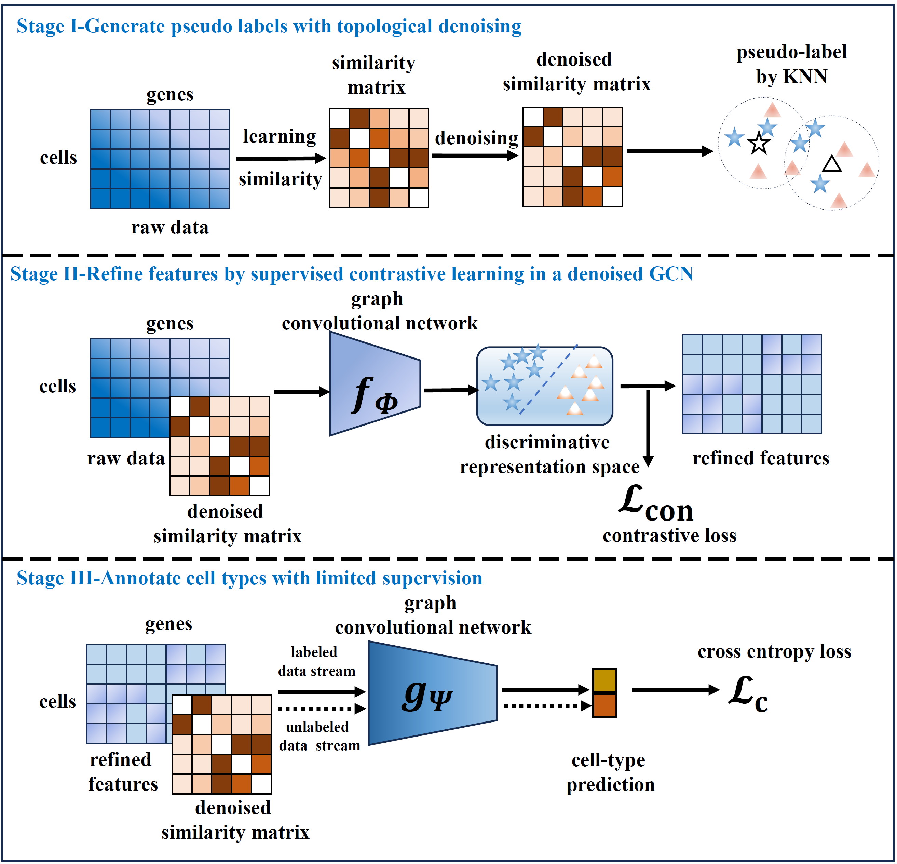

### scSemiGCN: boosting cell-type annotation from noise- resistant graph neural networks with extremely limited supervision

In this repository, we provide source codes of scSemiGCN written in *Python*.

#### Dependencies

* *Python* >=3.6
* *Torch* >= 1.4.0

#### Work flow

The work flow of scSemiGCN is presented below.



#### Preparing data of cell-type annotation by scSemiGCN

We provide two datasets as running examples. 

* **seqdata.mat:** Constructed from Buettner[1].
* **largeset.mat:** Constructed from Cortex[2]. The largeseqmat.mat file used in src_gpu can be downloaded from https://pan.baidu.com/s/15htOzVeUEDeA3mAcqq7eng?pwd=zw7p with password zw7p. Please note that  expression matrix in the  largeseqmat.mat is stored as *a sparse matrix*.

[1] Wang, B. et al. (2017) Visualization and analysis of single cell RNA-seq data by kernel-based similarity learning. Nature Methods, 14, 414-416.

[2] Dong, J. et al. (2022) scSemiAE: a deep model with semi-supervised learning for single-cell transcriptomics. BMC Bioinformatics, 23, 161.

Fields of the mat files include:

* **feature**:  The #cell x #genes  expression matrix with ***annotated cells followed by unannotated cells***.

* **similarity**: Similarities between cells learned by **[SIMLR](https://github.com/BatzoglouLabSU/SIMLR)**,  a #cell x # cell matrix. Users can also try different simiarities (e.g gaussian kernel similarites)
* **annotation**: Indication of annotation, a #cell x 1 matrix.  Annotation for cells are indicated by positive integers and unannotated cells are indicated by -1.

Rows of the all three fields should be ***matched***.

#### Running scSemiGCN

We provide two *cpu-* and *cuda-version* of implementation in **src** and **src_gpu**, respectively. For a large-scale dataset, please try src_gpu. To run main.py in **src**, a few parameters are needed to be set:

* **Nk**: Size of neighborhood in topological denoising.
* **alpha**: Regularization parameter for restart topological denoising.

* **round**:  Numbers of epoch for supervised contrastive learning.
* **dropout:** Dropout rate for GCNs.
* **slr:** Learning rate for supervised contrastive learning.
* **weight_decay:** Weight decay in supervised contrastive learning.
* **tau:** Temperature for supervised contrastive loss.
* **hidden:** Dimension of the hidden layer for the two-layer GCN.
* **glr:** Learning rate for training cell-type annotation GCN.
* **epoch:** Number of epochs for training cell-type annotation GCN.
* **batch_size:** Batch size for training cell-type annotation GCN.
* **dir:** Directory for output.

An additional parameter is needed to be set when running main.py in **src_gpu**:

* **scl_batch_size:** Batch size for supervised contrastive learning.

Please refer to the function ***params()*** in main files for default settings of these parameters.

It can be run in command lines with parameter settings, for example

```
python main.py --Nk 18 --alpha 0.5 --round 10 --dropout 0.5 --slr 0.05 --weight_decay 1e-2 --tau 0.5 --hidden 100 --glr 0.001 --epoch 100 --batch 100 --dir Prediction
```

Prediction of annotation for unannotated cells is saved as a csv file in the output directory along with a well-trained cell-type annotation model.

Please refer to directories src and src_gpu and the file tutorial.ipynb (see the src directory) for further details.